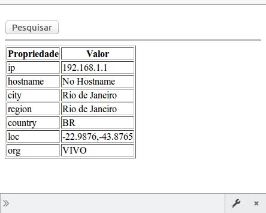

# Angular 2 Stupid Start

*By Cleuton Sampaio*

[Brazilian Portuguese ](README_PT-BR.md)

Angular 2 is not easy to learn, despite their efforts creating a tutorial, even this tutorial is quite difficult to understand. There are many new concepts, and a good deal of Accidental Complexity, which even frightens Java developers.

**Stupid Start** Shows a simple REST/Web app, which consumes a public RESTful service. It does not show you all the *bells and whistles* of a full-fledged Angular 2.x app, 
but it will turn you up and running faster, allowing you to learn the basics and preparing you to make more complex apps latter.

Just follow the instructions. If you want, you can clone the full app on this repository, and just run it.

Oh, BTW, it will help a lot if you already know **Java** or other OOP language, like **C++**, **python** or **Ruby**. 

## OMG! How to I begin?

Ok, your boss has sold a new and improved web interface to the Client! He said that it would use Angular 2 
(or perhaps Angular 4.0). And you, with your *rough* experience of Angular 1.x, are not prepared. Just 

**CALM YOU KEEP, AND THE PATH YOU FOLLOW, PADAWAN**

**Download the quickstart seed repository**

Angular team has created a very simple "quickstart" repository: [angular.io quickstart seed](https://github.com/angular/quickstart). Just
create a new folder, and download the ZIP into it. Do not clone the *Quickstart seed* repo. Relax! Don't bother with creating a Git repo or setup anything. 
The only tools you will need, you (probably) already have: [NPM and Node.js](https://nodejs.org/en/download/).

Once you have downloaded the ZIP file, extract it into the folder you created. 

Rename the extracted folder to "showMyIp", to be compatible with our app.

Of course, you can download **this app**, if you want. But this tutorial assumes that you have cloned the *Quickstart Seed* app.

Be sure you have at least the versions: node `v4.x.x` and npm `3.x.x`! Run `node -v` and `npm -v` to check the versions.

## About the app

The **Stupid Start** app is named "showMyIp", which does exactly this: Show Your External IP Address. 

 

That's it! You click on a button and it shows your IP etc. This information comes from a public RESTful service: 
**ipinfo.io**. Try this link using `curl` or `wget`: 

`curl http://ipinfo.io`

You should see something like this: 

```
curl http://ipinfo.io
{
  "ip": "192.168.1.1",
  "hostname": "No Hostname",
  "city": "Rio de Janeiro",
  "region": "Rio de Janeiro",
  "country": "BR",
  "loc": "-22.9876,-43.3207",
  "org": "VIVO"
}
```

We only need to get this JSON and navigate it using a `<tr>`.

Simple.

## Cut the crap

Ok, you probably noticed that there is a `package.json` file along with an `app` folder, right? So, open the main folder in a terminal
(I recommend [Visual Studio Code](https://code.visualstudio.com/)). 

Ok, if you are using *VSCODE*, so open the folder containing the `package.json` file, and select menu `view / Integrated Terminal`.
If you are using a simple Terminal (or Console), just navigate to the folder you just unpacked (which contains `package.json`) and 
type: 

`npm install`

This may take a while. NPM is installing some files inside a folder named: `node_modules`. All you must know for now is that this folder is a library of components, needed by Angular.

Open folder "app", inside the main folder, and take a look at the files: 

* **main.ts**: Angular application *bootstrap* script. It starts your app. And, BTW, it is written in [typescript language](https://www.typescriptlang.org/) (I forgot to tell you that... My bad!);
* **app.module.ts**: Your app's main module, which contains all the other components you created (also `typescript`);
* **app.component.ts**: Your app's main **Component**. There may be more components, if you need. Your app will be composed by Components like this (**OMG**! Everything is `typescript`!);

Run the current app by typing in the terminal: 

`npm start`

A new browser window should open and show your app's main page: 


Note the URL: `http://localhost:3000` this is the address of your local web server, opened by NPM. It is an option of `typescript` compiler (`tsc -w`) which compiles
all your `typescript` source code into `javascript`, and serve the `index.html` file using TCP port 3000.

**What happened?**

Ok, open `index.html`. Note that it imports a lot of crap, none of your app's: 

```
    <script src="node_modules/core-js/client/shim.min.js"></script>

    <script src="node_modules/zone.js/dist/zone.js"></script>
    <script src="node_modules/reflect-metadata/Reflect.js"></script>
    <script src="node_modules/systemjs/dist/system.src.js"></script>

    <script src="systemjs.config.js"></script>
```

But there are 2 things near the end of file: 

```
    <script>
      System.import('app').catch(function(err){ console.error(err); });
    </script>

```

and 

```
<my-app>Loading AppComponent content here ...</my-app>
``` 

Forget about the first one, just remember that it is necessary. Now, the last one is a custom tag `<my-app>`, and it is
    defined by your app, inside file `app.component.ts`: 

```
@Component({
  selector: 'my-app',
  template: `<h1>Hello {{name}}</h1>`,
})
```

This strage declaration is a **decorator**, a kind of Annotation that `typescript` uses to **complement** a class' declaration. Let's see the entire file `app.component.ts`: 

```
import { Component } from '@angular/core';

@Component({
  selector: 'my-app',
  template: `<h1>Hello {{name}}</h1>`,
})
export class AppComponent  { name = 'Show My IP'; }
```

We have a source file that **imports** an already existing module. You can import your own modules or modules created by others. In this case, we are importing an Angular module, 
which is the `@Component` decorator itself. Inside the decorator, we declare some metadata about our **Component**: its **tagname** and its **template**.

Our template is using an Angular **expression** (surrounded by "{{" and "}}"). The entire expression will be substituted by a *property* named `name`.

And this property is declared inside our **Component's** class, named `AppComponent`. 

**How is this Component loaded?**

Open file `app.module.ts` and you'll see: 

```
import { NgModule }      from '@angular/core';
import { BrowserModule } from '@angular/platform-browser';

import { AppComponent }  from './app.component';

@NgModule({
  imports:      [ BrowserModule ],
  declarations: [ AppComponent ],
  bootstrap:    [ AppComponent ]
})
export class AppModule { }
```

The main module for our app imports, declares and bootstraps our **Component's** class! If you have more components, they must be
declared inside `declarations` property (inside `@NgModule` decorator), but only one must be declared inside `bootstrap`, and is the initial component of your app.

**That's it**

And the file `app.component.spec.ts`? It is just for **Protractor** tests. Forget it by now.

## Let's build our app

Ok, now you know the general structure, right? Let's begin by changing the `app.component.ts` file to: 

```
import { Component } from '@angular/core';

@Component({
  selector: 'my-app',
  template: `
      <h1>Welcome to: {{name}}</h1>
      <input type="button" value="Pesquisar" (click)="pesquisar()"/>
      <hr/>
  `,
})
export class AppComponent  { 
  name = 'Show My IP';
  pesquisar(): Resultado {
    return null;
  } 
}
```

There must be some errors right now in the browser and in the VSCODE. We added a `button` with a `(click)` event, pointing to a `pesquisar()` funtion. 
This function is declared inside class `AppComponent`. Note that it returns something called `Resultado`, which does not exists yet.

The `typescript` sintax for functions is: 

```
function add(x: number, y: number): number {
    return x + y;
}

let myAdd = function(x: number, y: number): number { return x+y; }
```

I think you've got it! Let's not loose time with this. If you want to know more, check [typescript docs](https://www.typescriptlang.org/docs/tutorial.html).

Back to the `app.component` file, we need to create a class definition for `Resultado`. 

```
import { Component } from '@angular/core';

class Resultado {
  ip: string; 
  hostname: string;
  city: string;
  region: string;
  country: string;
  loc: string;
  org: string;  
}
...
```

This class has the same layout of our expected response. Note that all properties have types! That's the name **TYPE**script!

Now we need to get the data from `ipinfo`. The best way is to create a **Service** and get the external data there. But we want this app to be simple and **Stupid**, so, we are gonna get the data inside the same component file.
Add the import, just bellow the first import: 

```
import { Http, Response } from '@angular/http';
``` 

We imported 2 things: `Http` module and `Response` class. Now, we need to inject the `http` service into our Component's class. This is done using a **Constructor**, which initializes a **Private** property. Add this line just bellow the `export class...` line: 

```
    constructor(private http: Http) { }
```

But easy on that... The `HttpModule` which is the **Provider** for `Http` module, must be injected on our `AppModule` class! Open `app.module` and add the import, just bellow the first one: 

```
import { HttpModule } from '@angular/http';
``` 

And change the `import` property of `@NgModule` decorator to import `HttpModule` into our class: 

```
@NgModule({
  imports:      [ BrowserModule, HttpModule ],
```

Now the `HttpModule` is available to all components of our app. Let's return to `app.component` file. We need to import some files from [RxJS Reactive Extensions](https://github.com/Reactive-Extensions/RxJS) into our `app.component.ts` file: 

```
import {Observable} from 'rxjs/Rx';
import 'rxjs/add/operator/map';
import 'rxjs/add/operator/catch';
```

The `Http` service returns an instance of `Observable` class (which is a **template** class, like C++, or **Generics** like Java). And we need 2 methods: `map` and `catch`.

Now, let's add the code for the button to our Component's class. Add the code bellow, right after the "name" property declaration: 

```
  resultado: Resultado;
  pesquisar(): void {
    this.getIpData()
      .subscribe(
          res => {
            console.log(JSON.stringify(res))
            this.resultado = res}, 
          err => {
              console.log(err);
          });    
  } 

  getIpData() : Observable<Resultado> {
    return this.http.get('http://ipinfo.io')
      .map((res:Response) => res.json())
      .catch((error:any) => Observable.throw(error.json().error || 'Server error'));
  }
```

**OMG! WTF IS THAT?**

Take a deep breath, and I will explain...

The `pesquisar()` function is invoked by the button we created, right? It is in the HTML template for our component.
This function uses another function, named `getIpData()`, which is also declared in our component. 

The first function (`pesquisar()`) just invokes `getIpData()`, which return an instance of `Observable<Resultado>`. `Observable` is a **template** class, and it allows us to monitor asynchronously the results of getting an Ip Data.
    The method `subscribe()` of an `Observable` allow us to get the results using a **lambda** expression (and the error too).

So, the second function (`getIpData()`) uses `http.get()` to send a **GET** request to the RESTful service. Then, we use the `map` function (which we have just imported) to get the json() response. We also use the `catch` function, to get the error.

This is how we get data using `http` service. It will be easier to use `Promise`, but it is outside the scope for this demo.

**Let's change the HTML template**

We need to show the properties using a `<table>`. This is easy! Just change the `template` property of the `@Component` decorator to: 

```
  template: `
      <h1>Welcome to: {{name}}</h1>
      <input type="button" value="Pesquisar" (click)="pesquisar()"/>
      <hr/>
      <div *ngIf="resultado">
          <table border="1">
              <thead>
                  <tr role="row">
                      <th>Propriedade</th>
                      <th>Valor</th>
                  </tr>
              </thead>
              <tbody>
                  <tr>
                      <td>ip</td>
                      <td>{{resultado.ip}}</td>
                  </tr>
                  <tr>
                      <td>hostname</td>
                      <td>{{resultado.city}}</td>
                  </tr>
                  <tr>
                      <td>region</td>
                      <td>{{resultado.region}}</td>
                  </tr>
                  <tr>
                      <td>country</td>
                      <td>{{resultado.country}}</td>
                  </tr>
                  <tr>
                      <td>loc</td>
                      <td>{{resultado.loc}}</td>
                  </tr>
                  <tr>
                      <td>org</td>
                      <td>{{resultado.org}}</td>
                  </tr>
              </tbody>
          </table>        
      </div> 
  `
``` 

The "`" signal allows us to use multiline strings. This ends our tutorial. 


## Did it run?

If you left the terminal open, the webserver is updating at each file change, and you should see the final app running. But, if the results are different, try to compare your files with my files (in the repository).

This is the first Angular 2.x> tutorial. Excuse-me my bad english skills and cursewords. More tutorials ar coming, and remember: This is a **Stupid Start**. just to get you up and running faster.

